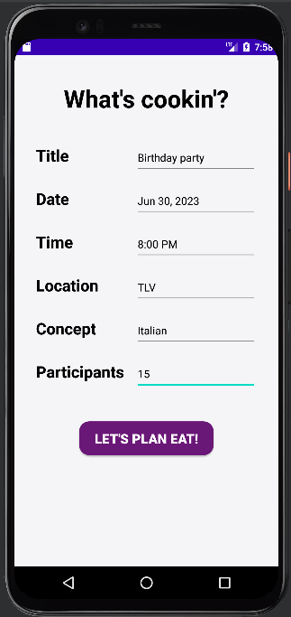
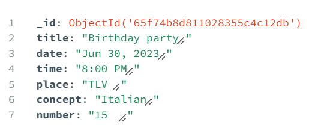
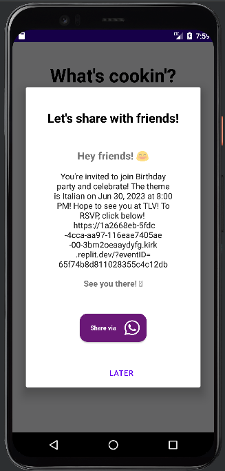
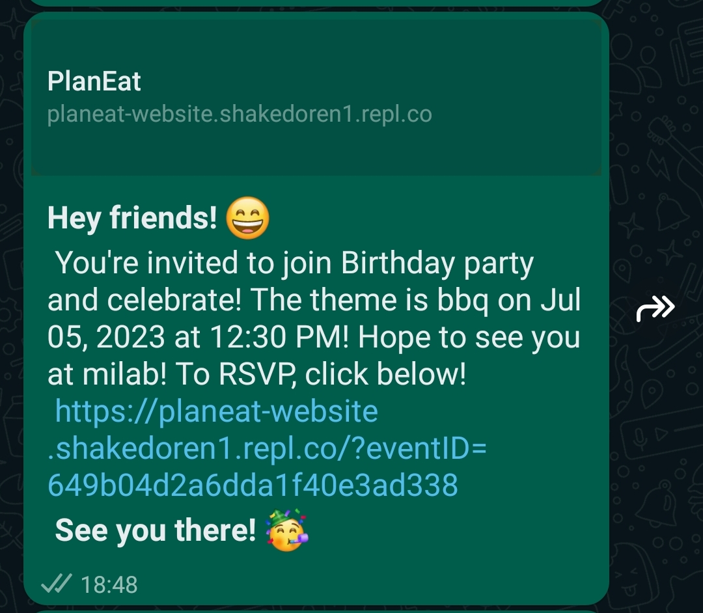
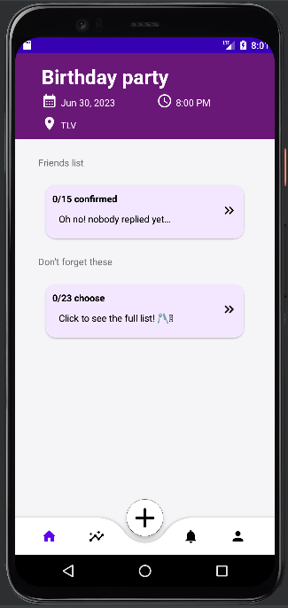
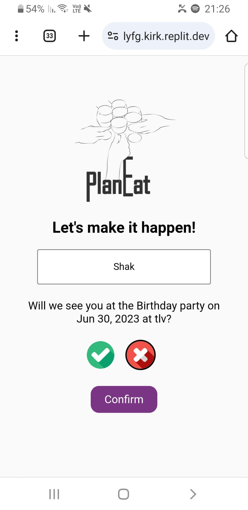
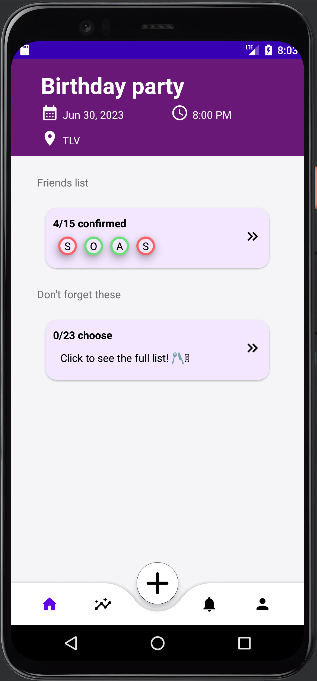
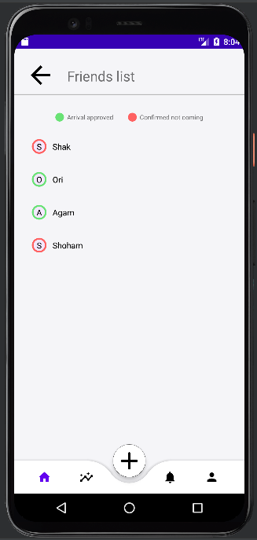

# PlanEat
### An android app created to help organize social gatherings.
The app was developed in java using Android Studio. The website that connects to the app is a simple combination of HTML, CSS and JS. And the database for the app and the website is a mongoDB.  
The server that connects both the app and the website to the database and other online services (such as openAI api) in a Node.js server.

Here is a brief flow of the app:

##### Creating a new event: 

##### The event is inserted into the database and gets a unique ID: 

##### You get a custom message to share with your friends on Whatsapp: 
  

##### The home page created for the event: 

##### The confirmation website that links to the specific event available for anyone that received the link: 

##### The event home page after a few people responded: 

 

Inside the app we used fragments for the different windows of the app. Each event is stored inside the database and each RSVP is also saved to the database with the relevant event ID. There is also an AI generated ingredient list for the event based on the concept and number of people invited.